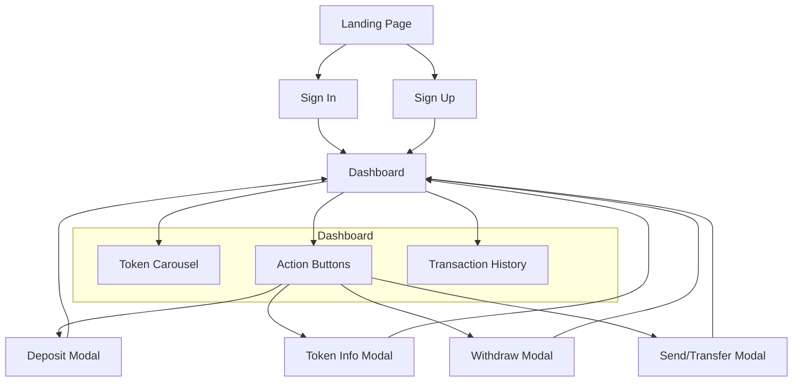
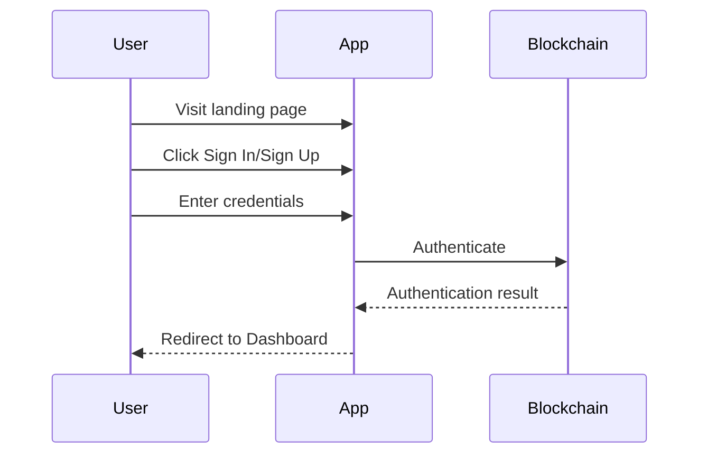
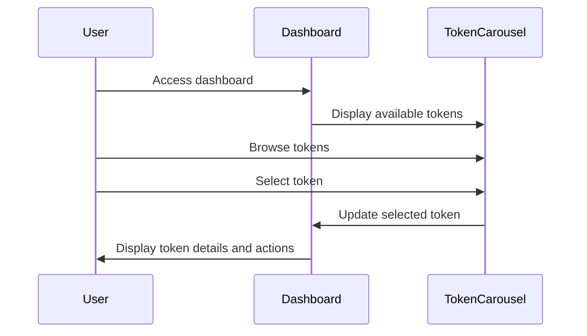
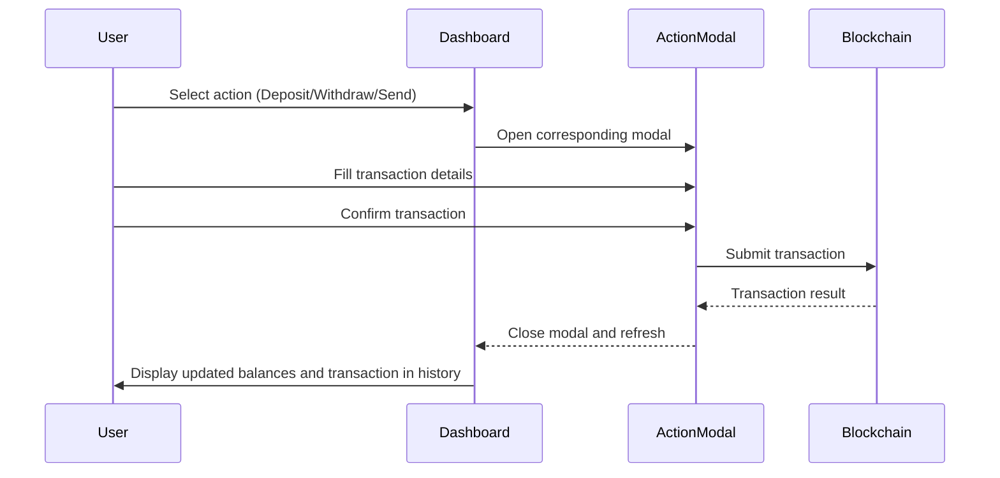

# Confidential Asset Web Application UI Sitemap

This UI sitemap provides a comprehensive overview of the application structure, user flows, and key features to guide designers in understanding and redesigning the application.

## Application Overview

The Confidential Asset Web Demo is a blockchain application built on the Aptos network that allows users to manage confidential assets (tokens) securely. Users can view their token balances, deposit, withdraw, and transfer tokens, as well as view their transaction history.

## Site Structure

## Pages and Components

### 1. Landing Page (/)
- **Purpose**: Introduction to the application
- **Key Components**:
  - Introduction to confidential assets
  - Sign in/Sign up buttons
  - Branding elements

### 2. Authentication Pages
- **Sign In (/sign-in)**
  - Login form with email/password
  - Authentication status handling

- **Sign Up (/sign-up)**
  - Registration form
  - Account creation flow

### 3. Dashboard (/dashboard)
- **Main Interface Components**:
  - Header with account information
  - Token carousel for viewing different tokens
  - Action buttons (Deposit, Token Info, Withdraw, Send)
  - Transaction history list

### 4. Modal Sheets
- **Deposit Modal**
  - Form for depositing tokens
  - Options for manual deposit or minting

- **Token Info Modal**
  - Displays detailed information about the selected token
  - Token address, name, symbol, etc.

- **Withdraw Modal**
  - Form for withdrawing tokens to external wallet
  - Amount input and confirmation

- **Send/Transfer Modal**
  - Form for sending tokens to another user
  - Recipient address and amount inputs

## User Flows

### 1. Authentication Flow

### 2. Token Management Flow

### 3. Transaction Flow

## Key Features and Use Cases

### 1. Token Management
- **View Tokens**: Users can view their confidential tokens in a carousel
- **Token Details**: Users can view detailed information about each token
- **Add Tokens**: (Currently disabled) Users can add new tokens to their portfolio

### 2. Financial Operations
- **Deposit**: Users can deposit tokens into their confidential account
- **Withdraw**: Users can withdraw tokens from their confidential account
- **Send/Transfer**: Users can send tokens to other users

### 3. Transaction Tracking
- **History**: Users can view their transaction history
- **Transaction Types**: Various transaction types are displayed with different icons:
  - Transfer (regular and native APT)
  - Deposit
  - Withdraw
  - Rollover
  - Key rotation
  - Freeze/Unfreeze
  - Register
  - Normalize
  - Mint

### 4. Security Features
- **Account Status**: Shows if the account is registered, normalized, or frozen
- **Pending Amounts**: Displays pending transactions that haven't been confirmed
- **Actual Amounts**: Shows confirmed balances

## Design Considerations

### 1. Mobile Responsiveness
- The application adapts to mobile devices with appropriate layouts
- Modal sheets appear from the bottom on mobile and from the right on desktop

### 2. Visual Hierarchy
- Token carousel is prominently displayed
- Action buttons are easily accessible
- Transaction history provides a clear record of activities

### 3. State Management
- Loading states for various operations
- Error handling for failed operations
- Success confirmations for completed transactions

### 4. Accessibility
- Clear navigation
- Descriptive icons with text labels
- Consistent interaction patterns

## Technical Context

The application is built with:
- Next.js (React framework)
- TailwindCSS for styling
- Aptos blockchain integration
- Confidential asset protocols for privacy

This UI sitemap provides designers with a comprehensive understanding of the application's structure, flows, and features to guide the redesign process.
